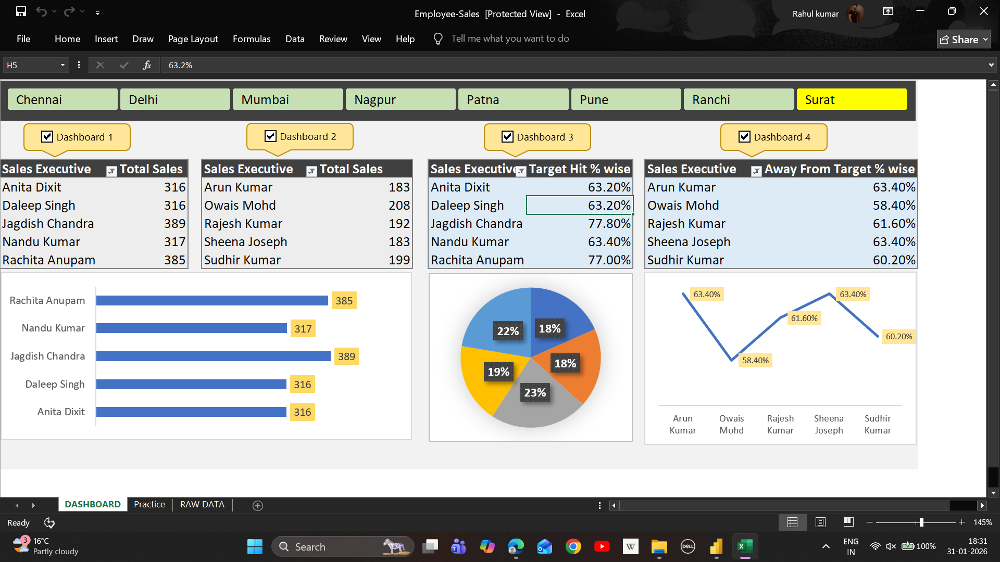

# 📊 Employee Sales Performance Dashboard – Excel Project

---

## 🔹 Project Overview

| Field | Details |
|------|--------|
| Project Name | Employee Sales Performance Dashboard |
| Tool Used | Microsoft Excel |
| Domain | Sales & Performance Analytics |
| Dashboard Type | Interactive Excel Dashboard |
| Objective | Monitor employee-wise sales & target performance |

---

## 🎯 Business Objectives

| Objective ID | Description |
|-------------|-------------|
| OBJ-01 | Track total sales by sales executives |
| OBJ-02 | Compare performance across cities |
| OBJ-03 | Measure target achievement percentage |
| OBJ-04 | Identify employees away from target |
| OBJ-05 | Enable quick management-level insights |

---

## 📌 Key Metrics Tracked

| Metric | Description |
|------|-------------|
| Total Sales | Total sales generated by each employee |
| Target Hit % | Percentage of target achieved |
| Away From Target % | Gap between actual sales and target |
| City-wise Performance | Sales comparison across cities |
| Employee Ranking | Performance comparison among employees |

---

## 🏙 City-wise Coverage

| Cities Analyzed |
|----------------|
| Chennai |
| Delhi |
| Mumbai |
| Nagpur |
| Patna |
| Pune |
| Ranchi |
| Surat |

---

## 📈 Dashboard Components

| Component | Purpose |
|---------|---------|
| Bar Charts | Employee-wise total sales |
| Pie Chart | Target hit % contribution |
| Line Chart | Away from target trend |
| Slicers | City-based filtering |
| Tables | Employee-level sales details |

---

## 🛠 Tools & Techniques Used

| Tool / Feature | Usage |
|--------------|------|
| Microsoft Excel | Dashboard development |
| Pivot Tables | Data summarization |
| Pivot Charts | Visual analytics |
| Slicers | Interactive filtering |
| Conditional Formatting | Performance highlighting |

---

## 📂 Repository Structure

| Folder/File | Description |
|------------|------------|
| /dashboard | Excel dashboard file |
| /dataset | Raw employee sales data |
| /images | Dashboard screenshots |
| README.md | Project documentation |
| LICENSE | MIT License |

---

## 🖼 Dashboard Preview

| View | Image |
|----|------|
| Employee Sales Overview |  |

---

## 💡 Business Use Cases

| Use Case ID | Application |
|------------|------------|
| UC-01 | Sales team performance evaluation |
| UC-02 | Target tracking & gap analysis |
| UC-03 | City-level sales planning |
| UC-04 | Incentive & appraisal decisions |
| UC-05 | Management reporting |

---

## ▶ How to Use

| Step | Action |
|----|-------|
| Step 1 | Download Excel dashboard file |
| Step 2 | Open in Microsoft Excel |
| Step 3 | Use slicers to filter cities |
| Step 4 | Analyze employee performance |

---

## 📜 License

| Type | Description |
|----|-------------|
| License | MIT License |
| Usage | Free to use with attribution |

---

## 👤 Author

| Field | Details |
|----|--------|
| Name | Rahul Kumar|
| Role | Aspiring Data Analyst |
| Skills | Excel, Power BI, SQL |
| Focus | Sales & Business Analytics |

---
